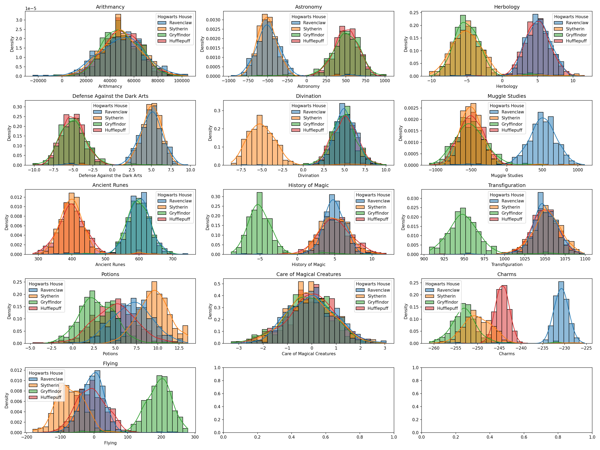
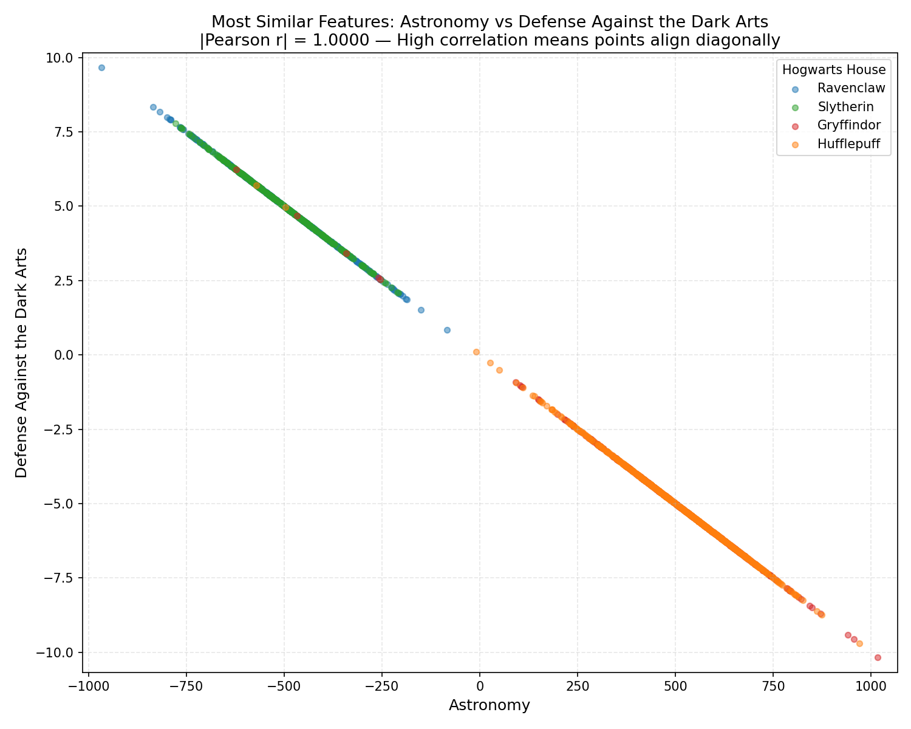
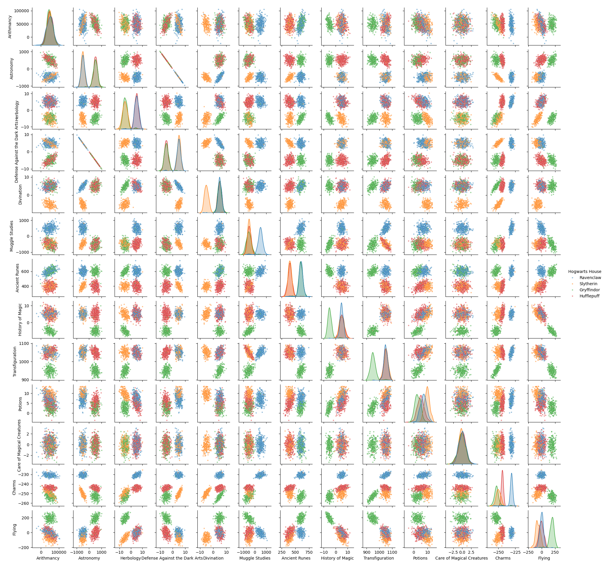

# DSLR - DataScience x Logistic Regression 🧙‍♂️✨

Un proyecto de Machine Learning basado en el universo de **Harry Potter** (42 School). El objetivo es construir desde cero un clasificador multiclase mediante **Regresión Logística (One-vs-All)**, complementado con análisis exploratorio de datos (EDA), visualización estadística y optimizadores avanzados de descenso de gradiente.

---

## 📋 Tabla de Contenidos
- [Descripción General](#-descripción-general)
- [Estructura del Proyecto](#-estructura-del-proyecto)
- [Instalación y Requisitos](#-instalación-y-requisitos)
- [Fases del Proyecto](#-fases-del-proyecto)
  - [1. Data Analysis (describe.py)](#1-data-analysis-describepy)
  - [2. Data Visualization](#2-data-visualization)
    - [Histogramas (histogram.py)](#histogramas-histogrampy)
    - [Diagrama de Dispersión (scatter_plot.py)](#diagrama-de-dispersión-scatter_plotpy)
    - [Pair Plot (pair_plot.py)](#pair-plot-pair_plotpy)
  - [3. Logistic Regression (One-vs-All)](#3-logistic-regression-one-vs-all)
    - [Entrenamiento (logreg_train.py)](#entrenamiento-logreg_trainpy)
    - [Predicción (logreg_predict.py)](#predicción-logreg_predictpy)
  - [4. Bonus: Optimizadores de Gradiente](#4-bonus-optimizadores-de-gradiente)
- [Resultados y Conclusiones](#-resultados-y-conclusiones)

---

## 🔍 Descripción General

El **Sombrero Seleccionador** ha dejado de funcionar y la tarea de clasificar a los estudiantes de Hogwarts en una de las cuatro casas recae en algoritmos de Data Science:
- **Gryffindor** 🦁
- **Hufflepuff** 🦡
- **Ravenclaw** 🦅
- **Slytherin** 🐍

A partir del historial académico de calificaciones en materias mágicas (*Arithmancy, Astronomy, Herbology, Defense Against the Dark Arts, Divination, Muggle Studies, Ancient Runes, History of Magic, Transfiguration, Potions, Care of Magical Creatures, Charms, Flying*), el modelo aprende las fronteras de decisión probabilísticas para cada casa.

---

## 📁 Estructura del Proyecto

```text
dslr/
├── data/
│   ├── dataset_train.csv       # Dataset de entrenamiento con etiquetas de casas
│   └── dataset_test.csv        # Dataset de prueba sin etiquetas
├── src/
│   ├── bonus/
│   │   └── methods.py          # Implementaciones: Batch, SGD, Mini-Batch, Momentum
│   ├── outputs/
│   │   ├── batch_model.json    # Parámetros y pesos entrenados con Batch GD
│   │   ├── sgd_model.json      # Modelo entrenado con SGD
│   │   ├── mini-batch_model.json
│   │   ├── momentum_model.json
│   │   └── houses.csv          # Predicciones generadas para el test set
│   ├── describe.py             # Estadísticas descriptivas implementadas desde cero
│   ├── histogram.py            # Distribución de notas por casa y curso
│   ├── scatter_plot.py         # Análisis de correlación entre características
│   ├── pair_plot.py            # Matriz de dispersión multivariable
│   ├── logreg_train.py         # Entrenamiento con Regresión Logística One-vs-All
│   └── logreg_predict.py       # Clasificación y generación de outputs
├── histograms.png              # Gráfico generado por histogram.py
├── scatter_plot.png            # Gráfico generado por scatter_plot.py
├── pair_plot.png               # Gráfico generado por pair_plot.py
├── requirements.txt            # Dependencias del entorno
└── README.md
```
---

## ⚙️ Instalación y Requisitos

1. **Clonar el repositorio:**
   `bash
   git clone <URL_DEL_REPOSITORIO> dslr
   cd dslr
   `

2. **Crear y activar un entorno virtual:**
   `bash
   python3 -m venv myenv
   source myenv/bin/activate
   `

3. **Instalar dependencias:**
   `bash
   pip install -r requirements.txt
   `

*Librerías principales requeridas:* 
numpy, pandas, matplotlib, seaborn.

---

## 🚀 Fases del Proyecto

### 1. Data Analysis (describe.py)

Reimplementación manual del método describe() de pandas sin usar funciones estadísticas predeterminadas. Calcula para cada variable numérica:

- **Count:** Número de valores presentes (excluyendo valores nulos/NaN).
- **Mean:** Media aritmética.
- **Std & Var:** Desviación estándar muestral (-1$) y varianza.
- **Min / Max:** Valor mínimo y máximo.
- **Percentiles (25%, 50%, 75%):** Cuartiles mediante interpolación lineal.
- **Range & IQR:** Rango total ($\text{Max} - \text{Min}$) y rango intercuartílico ( - Q_1$).

**Uso:**
`bash
python3 src/describe.py data/dataset_train.csv
`

---

### 2. Data Visualization

#### Histogramas (histogram.py)
Muestra la distribución de notas en cada asignatura para las 4 casas con estimación de densidad (KDE).
- **Objetivo:** Identificar qué asignatura tiene una distribución de notas homogénea entre todas las casas o cuáles separan claramente una casa del resto.

`bash
cd src
python3 histogram.py
`
> Guarda la figura en histograms.png.



---

#### Diagrama de Dispersión (scatter_plot.py)
Calcula la correlación de Pearson entre todos los pares numéricos para descubrir las dos asignaturas más dependientes entre sí:

$$
\rho_{X,Y} = \frac{\mathrm{cov}(X,Y)}{\sigma_X \sigma_Y}
$$

- **Descubrimiento:** Las asignaturas **Astronomy** y **Defense Against the Dark Arts** tienen una correlación lineal prácticamente perfecta ($|r| \approx 1.0000$), mostrando una relación inversa estricta.

`bash
cd src
python3 scatter_plot.py
`
> Guarda la figura en scatter_plot.png.



---

#### Pair Plot (pair_plot.py)
Genera la matriz completa de correlaciones y gráficos de dispersión multidimensionales entre todas las asignaturas para visualizar agrupaciones por casa.

`bash
cd src
python3 pair_plot.py
`
> Guarda la figura en pair_plot.png.



---

### 3. Logistic Regression (One-vs-All)

La clasificación multiclase se resuelve mediante la técnica **One-vs-All (OvA)**: se entrenan 4 clasificadores binarios independientes, uno para cada casa ( = 1$) frente a las otras tres ( = 0$).

#### Preprocesamiento del Dataset
1. **Manejo de nulos:** Imputación con la mediana de cada columna (illna(median)).
2. **Encoding:** Mapeo de la columna Best Hand (Left: 0, Right: 1).
3. **Estandarización Z-score:**
   x_{\text{norm}} = \frac{x - \mu}{\sigma}
   Los parámetros $\mu$ y $\sigma$ se guardan junto con el modelo para estandarizar el conjunto de test bajo la misma distribución.
4. **Término de sesgo (Bias):** Se añade un vector de unos  = 1$ a la matriz de características.

### Función de Hipótesis (Sigmoide)

$$
h_\theta(x) = \frac{1}{1 + e^{-\theta^T x}}
$$

### Función de Coste (Binary Cross-Entropy / Log Loss)

$$
J(\theta) = -\frac{1}{m} \sum_{i=1}^{m} \left[ y^{(i)} \log\left(h_\theta\left(x^{(i)}\right)\right) + \left(1 - y^{(i)}\right) \log\left(1 - h_\theta\left(x^{(i)}\right)\right) \right]
$$

#### Entrenamiento (logreg_train.py)
Calcula los pesos $\theta$ para cada clasificador y los almacena en src/outputs/:

`bash
# Entrenamiento por defecto (Batch Gradient Descent)
python3 src/logreg_train.py data/dataset_train.csv batch

# Con seguimiento del coste
python3 src/logreg_train.py data/dataset_train.csv batch debug
`

#### Predicción (logreg_predict.py)
Aplica la normalización aprendida, evalúa las 4 sigmoides y selecciona la casa con mayor probabilidad para cada estudiante:

`bash
python3 src/logreg_predict.py data/dataset_test.csv src/outputs/batch_model.json
`
> Genera el archivo final src/outputs/houses.csv con las predicciones.

---

### 4. Bonus: Optimizadores de Gradiente

Se han desarrollado variantes del descenso de gradiente en src/bonus/methods.py:

| Método | Comando | Características |
| :--- | :--- | :--- |
| **Batch GD** | python3 src/logreg_train.py data/dataset_train.csv batch | Evalúa el gradiente promedio sobre todos los ejemplos en cada paso. Convergencia estable. |
| **Stochastic GD (SGD)** | python3 src/logreg_train.py data/dataset_train.csv sgd | Actualiza pesos muestra a muestra con barajado aleatorio (*shuffle*) por época. Ideal para conjuntos masivos. |
| **Mini-Batch GD** | python3 src/logreg_train.py data/dataset_train.csv mini-batch | Actualizaciones en bloques de tamaño fijo (atch_size=32), combinando estabilidad y velocidad. |
| **Momentum GD** | python3 src/logreg_train.py data/dataset_train.csv momentum | Incorpora memoria de velocidad ($\beta = 0.9$) para acelerar en cañones de baja pendiente y amortiguar oscilaciones. |

---

## 📊 Resultados y Conclusiones

- El análisis exploratorio demuestra que ciertas asignaturas (como *Charms*, *Flying*, *Astronomy*) proporcionan una separación clara entre las distintas casas de Hogwarts.
- La normalización z-score resulta fundamental para garantizar la convergencia del algoritmo de descenso de gradiente.
- La estrategia One-vs-All combinada con regularidad en el preprocesamiento produce un clasificador robusto con alta precisión.
